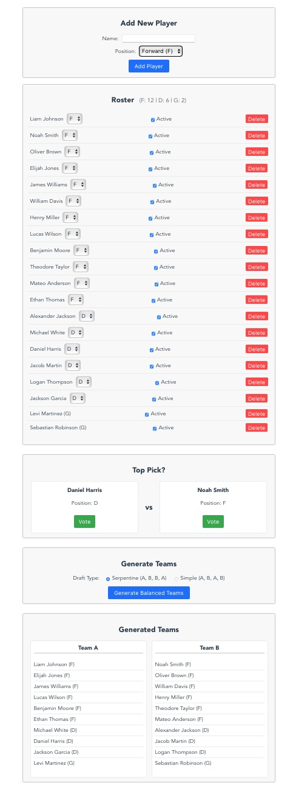

# FNHL Beer League Team Balancer

This web application helps manage a roster for a beer league (like the FNHL), rank players based on peer voting, and generate balanced teams for games.

## Features

*   **Roster Management:** Add/remove players, set positions (F/D/G), and mark players as active/inactive for a game.
*   **Relative Skill Ranking:** Uses a "Top Pick?" (Hot or Not style) voting system to compare players and generate a win/loss ratio. Goalies are compared only against other goalies.
*   **Balanced Team Generation:** Drafts active players onto two teams using either a Simple (A,B,A,B) or Serpentine (A,B,B,A) draft based on their win ratio. Forwards are drafted first (Team A gets 1st pick), then Defensemen (Team B gets 1st pick), then Goalies (assigned based on lowest team skater win total).
*   **Manual Adjustments:** Allows dragging and dropping players between generated teams for final tweaks.
*   **Leaderboard:** View ranked active players on a separate `/leader` page.
*   **Dark Mode:** Includes a theme toggle.
*   **Data Persistence:** Player data is saved to `data/players.json` via the Vite development server middleware.

## Example Screenshot



## Setup and Running

1.  **Install Dependencies:**
    ```bash
    npm install
    ```
2.  **Run Development Server:**
    ```bash
    npm run serve
    ```
    The application will be available at `http://localhost:5173` (or the next available port).

## Data Storage

During development (`npm run serve`), player data is read from and written to `data/players.json` using custom Vite middleware. This file should be committed to version control if you want to share the roster data. For a production deployment, a proper backend API would be required to handle data persistence.
